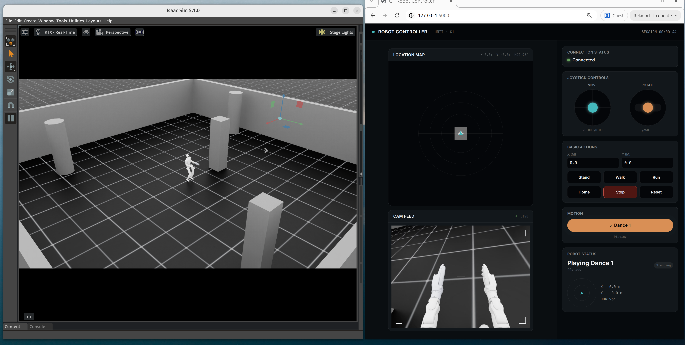

# Robots

*[English](README.md)*

  

이 프로젝트는 영상에서 인간의 동작 데이터를 추출하고, 이를 Unitree G1 제어 정책의 행동 복제 학습에 활용합니다.
데이터 생성에는 [GEM-X](https://github.com/NVlabs/GEM-X)와 [SOMA-Retargeter](https://github.com/NVIDIA/soma-retargeter)를 사용하여 모션 데이터셋을 구축했습니다.

## g1_isaac: Unitree G1 학습 및 제어

`g1_isaac` 폴더는 이 저장소의 핵심 학습 및 평가 워크스페이스입니다.
여기에는 Unitree G1 휴머노이드 로봇의 보행 및 모션 모방 정책을 개발하기 위한
Isaac Sim + Isaac Lab 기반 파이프라인이 포함되어 있습니다.

## 기능 업데이트

<strong>Web Controller</strong>

  

브라우저에서 시뮬레이션된 Unitree G1를 제어할 수 있는 웹 기반 컨트롤러입니다.
- [English docs](g1_isaac/docs/web-controller.en.md)
- [한글 문서](g1_isaac/docs/web-controller.md)

<h3 style="display: flex; align-items: center; gap: 0.75em; margin-top: 1.5em; line-height: 1.5;">핵심 설정 </h3>

- 시뮬레이터: Isaac Sim
- 프레임워크: Isaac Lab
- 로봇: Unitree G1
- AI 모델: 강화 학습(RL), 행동 복제 학습(IL)
- 정책 유형: PPO, AMP 및 관련 액터-크리틱 변형

<h3 style="display: flex; align-items: center; gap: 0.75em; margin-top: 1.5em; line-height: 1.5;">이 폴더의 활용 목적 </h3>

- G1 로봇을 위한 물리 기반 시뮬레이션 환경 구성
- 재타겟팅된 모션 데이터를 활용한 모션 추적 및 모션 모방 정책 학습
- 시뮬레이션에서 정책 재생 및 정상 동작 점검
- 실험 로그, 체크포인트, 재현 가능한 훈련 설정 관리

<h3 style="display: flex; align-items: center; gap: 0.75em; margin-top: 1.5em; line-height: 1.5;">주요 학습 파이프라인 </h3>

- AMP 행동 복제 파이프라인:
	참조 모션 클립으로부터 스타일에 맞는 움직임을 학습하기 위해 적대적 모션 사전(Adversarial Motion Prior)을 사용합니다.
	일반적으로 `g1_isaac/scripts/skrl/`의 스크립트로 실행됩니다.

- PPO 모션 추적 파이프라인:
	재타겟팅된 궤적을 따라가도록 손으로 설계한 추적 보상(DeepMimic 스타일)을 사용합니다.
	이 기능은 `g1_isaac/scripts/asap/`에 있는 ASAP 스타일 구현으로 제공됩니다.

<h3 style="display: flex; align-items: center; gap: 0.75em; margin-top: 1.5em; line-height: 1.5;">주요 폴더 소개 </h3>

- `g1_isaac/source/g1_isaac/`:
	Python 확장 소스 코드(환경, 작업 등록, 설정 포함)
- `g1_isaac/scripts/`:
	학습, 재생, 더미 에이전트, 유틸리티 실행 진입점
- `g1_isaac/data/`:
	행동 복제/추적에 사용되는 재타겟팅된 모션 파일
- `g1_isaac/logs/` 및 `g1_isaac/outputs/`:
	체크포인트, 학습 로그, 산출 결과와 같은 훈련 산물
- `g1_isaac/docs/`:
	과제별 메모 및 알고리즘 설명

<h3 style="display: flex; align-items: center; gap: 0.75em; margin-top: 1.5em; line-height: 1.5;">일반적인 워크플로 </h3>

1. 사용 가능한 작업 등록/목록 확인
2. 정책 학습(AMP 또는 PPO 기반 파이프라인)
3. 정책 재생 및 선택적 영상 녹화로 검증
4. 체크포인트를 비교하고 보상/설정 값을 반복적으로 조정

요약하면, `g1_isaac`는 Isaac Sim 기반 Unitree G1 정책 학습을 위한 실전 중심 허브이며,
강화 학습과 행동 복제 학습 두 흐름을 모두 지원합니다.
