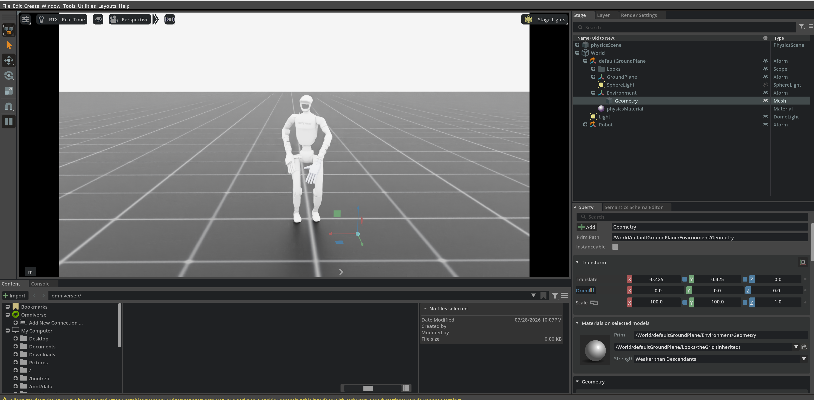

# Robots

  

This project extracts human motion data from videos and uses it for imitation learning of Unitree G1 control policies.
For data generation, we used [GEM-X](https://github.com/NVlabs/GEM-X) and [SOMA-Retargeter](https://github.com/NVIDIA/soma-retargeter) to build motion datasets for imitation learning.

## g1_isaac: Unitree G1 Learning and Control

The `g1_isaac` folder is the main training and evaluation workspace in this repository.
It contains an Isaac Sim + Isaac Lab based pipeline for developing locomotion and motion-imitation
policies for the Unitree G1 humanoid robot.

### Core Setup

- Simulator: Isaac Sim
- Framework: Isaac Lab
- Robot: Unitree G1
- AI models: Reinforcement Learning (RL), Imitation Learning (IL)
- Policy families: PPO, AMP, and related actor-critic variants

### What This Folder Is Used For

- Building physics-based simulation environments for the G1 robot
- Training motion-tracking and motion-imitation policies from retargeted motion data
- Running policy playback and sanity checks in simulation
- Managing experiment logs, checkpoints, and reproducible training configs

### Main Training Pipelines

- AMP imitation pipeline:
	Uses adversarial motion priors to learn style-consistent movements from reference motion clips.
	This is commonly launched through the skrl scripts in `g1_isaac/scripts/skrl/`.

- PPO motion-tracking pipeline:
	Uses handcrafted tracking rewards (DeepMimic-style) to follow retargeted trajectories.
	This is provided by the ASAP-style implementation in `g1_isaac/scripts/asap/`.

### Key Folder Highlights

- `g1_isaac/source/g1_isaac/`:
	Python extension source code (environments, task registration, configs).
- `g1_isaac/scripts/`:
	Entry points for training, playback, dummy agents, and utilities.
- `g1_isaac/data/`:
	Retargeted motion files used for imitation/tracking.
- `g1_isaac/logs/` and `g1_isaac/outputs/`:
	Training artifacts such as checkpoints, run logs, and exported results.
- `g1_isaac/docs/`:
	Task-specific notes and algorithm details.

### Typical Workflow

1. Register/list available tasks.
2. Train a policy (AMP or PPO-based pipeline).
3. Validate by policy playback and optional video recording.
4. Compare checkpoints and iterate on reward/config settings.

In short, `g1_isaac` is the practical hub of this repository for Isaac Sim-based Unitree G1 policy
learning, with both reinforcement learning and imitation learning workflows.